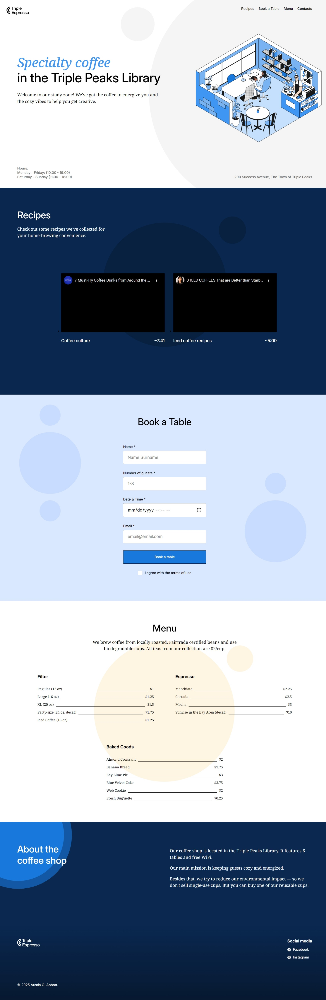

# Triple Peaks Coffee Shop

This project is the second assignment in the Software Engineering program at TripleTen. It is a responsive website for a coffee shop that allows customers to explore the menu and make table reservations. The site features an intuitive interface created using HTML5, CSS3, and Git for version control.

## Project Features

- Semantic HTML5
- Flexbox
- Positioning
- Flat BEM file structure
- Custom form
- CSS animations and transforms
- Responsive design techniques

## Pages and Technologies Used

### Home Page

- **Technologies**: HTML5, CSS3, Flexbox, BEM
- **Description**: The home page features a welcoming header with a navigation bar. Navigation links have a hover effect and use the transform property for smooth transitions. Links are clickable and direct users to the desired section of the webpage. The footer includes hours of operation and the coffee shop's address.

### Recipes Page

- **Technologies**: HTML5, CSS3, Flexbox, BEM, YouTube Embed
- **Description**: The recipes page includes embedded YouTube videos showcasing various coffee recipes.

### Reservations Page

- **Technologies**: HTML5, CSS3, Flexbox, BEM, Form Validation
- **Description**: The reservations page contains a custom form that allows users to book a table. The form includes fields for name, number of guests, date & time, and email, along with a checkbox for agreeing to terms of use. The form submit button has a hover effect and uses the transform property for smooth transitions.

### Menu Page

- **Technologies**: HTML5, CSS3, Flexbox, BEM
- **Description**: The menu page displays the coffee shop's offerings, including filter coffee, espresso, and baked goods, with prices listed for each item.

### About Page

- **Technologies**: HTML5, CSS3, Flexbox, BEM, CSS Animations
- **Description**: The about page provides information about the coffee shop's mission and environmental efforts, with animated background elements.

### Contacts Page

- **Technologies**: HTML5, CSS3, Flexbox, BEM
- **Description**: The contacts page includes the coffee shop's address, hours of operation, and social media links. It also implements a linear background gradient.

## Future Improvements

- **Online Ordering System**: Implement an online ordering system for customers to place orders for pickup or delivery.
- **Customer Reviews**: Add a section for customer reviews and ratings to enhance user engagement.
- **Interactive Map**: Integrate an interactive map to help customers locate the coffee shop easily.
- **Loyalty Program**: Develop a loyalty program where customers can earn points for purchases and redeem them for discounts.
- **Accessibility Enhancements**: Improve accessibility features to ensure the website is usable by people with disabilities.
- **Dark Mode**: Add a dark mode option for users who prefer a darker interface.
- **SEO Improvements**: Enhance SEO by adding meta tags, alt attributes for images, and improving the website's overall structure.

